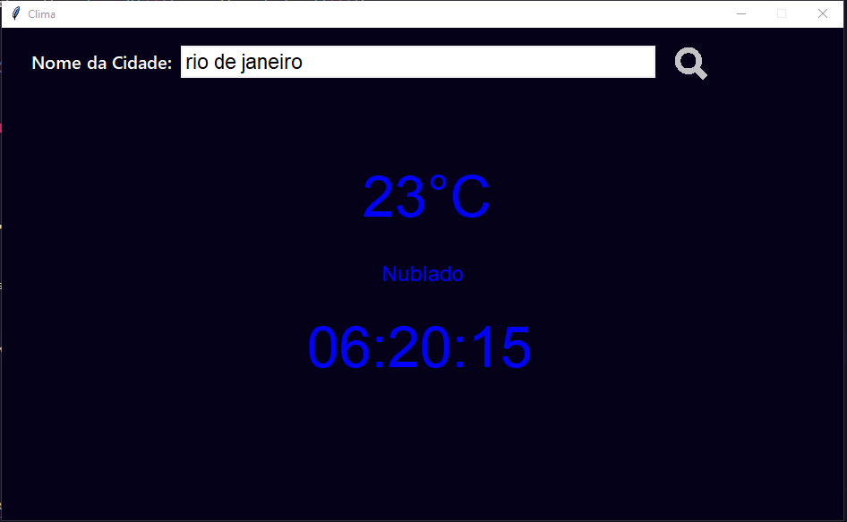

# Clima

### O projeto é um programa desenvolvido em Python com a biblioteca Tkinter e uma API de previsão do tempo para obter informações meteorológicas de uma determinada cidade. 


<br>

#### API Utilizada:
```text
https://api.exchangerate-api.com/v4/latest/BRL](http://api.openweathermap.org/data/2.5/weather?q={Nome_Cidade}&appid={self.API_KEY}&units=metric&lang=pt_br
```

<br>

<div style="display: inline_block"><br/>
  
</div>

<br>

<div style="display: inline_block">
  
</div>

